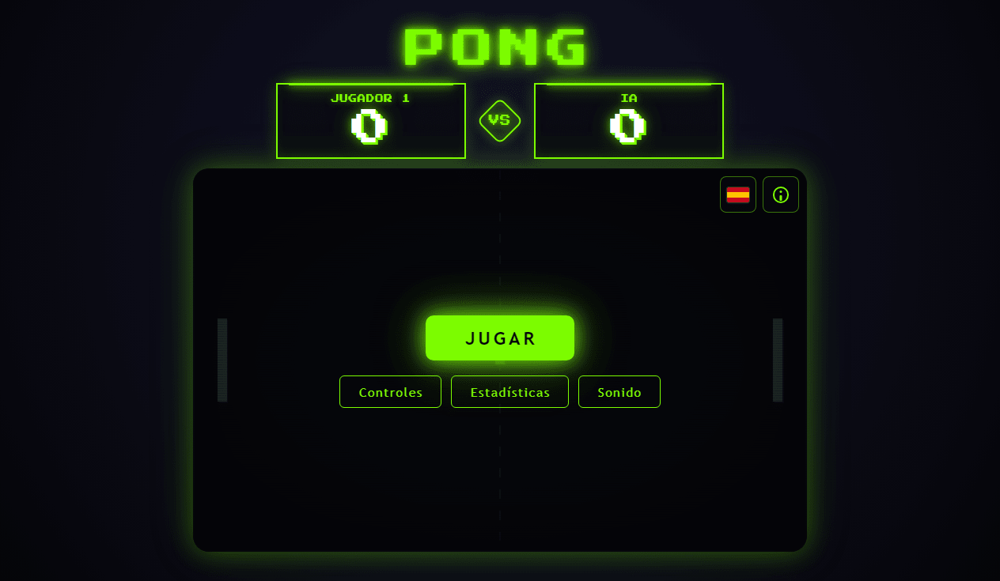

# PONG

Un Pong clásico hecho con HTML, CSS y JavaScript, sin frameworks ni dependencias. Se juega en el navegador, pero también se puede instalar en el móvil como app y en Windows como programa.

Puedes jugarlo aquí: **[https://mcifu-pong.netlify.app](https://mcifu-pong.netlify.app)**



## Qué incluye

- **Dos modos**: 1 jugador contra la IA (elige tu lado) o 2 jugadores en la misma pantalla.
- **Tres dificultades** para la IA: Fácil, Normal y Difícil.
- **Partidas** al mejor de 1, 3 o 5 puntos, con cuenta atrás 3-2-1.
- **Sonido y música** generados por código (sin archivos), con 3 temas musicales.
- **Personalización**: color de las palas, tema claro u oscuro y nombres de los jugadores.
- **Estadísticas** guardadas en el dispositivo: partidas, victorias, derrotas y tiempo de juego.
- **PWA instalable**: funciona sin conexión, con pantalla de carga y estética arcade.

## Controles

| Acción | Teclado | Táctil |
|---|---|---|
| Pala izquierda | `W` / `S` | Arrastrar el dedo |
| Pala derecha | `↑` / `↓` | Arrastrar el dedo |
| Empezar / reiniciar | `ESPACIO` | Botón |
| Pausar / reanudar | `P` | Botón |
| Volver al menú | `ESC` | Botón |
| Silenciar / sonido | `M` | Botón |

## Cómo ejecutarlo

Abre `index.html` directamente en el navegador. Para probarlo como PWA (instalación, offline), usa el servidor local:

```bash
npm start
```

Y abre `http://localhost:8000`.

## Publicación

### Google Play (Android)

Se publica envolviendo la PWA con [PWABuilder](https://www.pwabuilder.com):

1. Genera el paquete en PWABuilder y descarga el zip.
2. **Guarda el keystore** (clave de firma) del zip: es imprescindible para actualizar la app en el futuro.
3. Sube el archivo `.aab` en [Play Console](https://play.google.com/console) y rellena la ficha (textos en `PLAY-STORE.md`).
4. Las cuentas nuevas requieren una prueba cerrada con 12 testers durante 14 días antes de publicar.

- **Política de privacidad**: https://mcifu-pong.netlify.app/privacy.html

### iOS (iPhone)

- **Sin Mac**: abre `https://mcifu-pong.netlify.app` en Safari → *Compartir* → *Añadir a pantalla de inicio*. Se instala a pantalla completa y funciona sin conexión.
- **App Store**: genera el paquete iOS en PWABuilder y compílalo con **Xcode** en un Mac (requiere cuenta de desarrollador de Apple, 99 $/año).

### Windows (escritorio)

Con [Electron](https://www.electronjs.org/) se genera un instalador `.exe`:

```bash
npm install
npm run dist            # instalador en dist/
npm run dist:portable   # versión portable (un solo .exe)
```

La app instalada se actualiza sola desde GitHub Releases al publicar una versión nueva.

## Tecnologías

HTML5, CSS3, Canvas 2D y JavaScript vanilla. Web Audio API para el sonido, Service Worker para el modo offline y localStorage para guardar ajustes y estadísticas.

## Estructura

```
├── index.html              Página principal
├── manifest.webmanifest    Configuración de la PWA
├── sw.js                   Service worker (caché offline)
├── css/style.css           Estilos
├── js/script.js            Lógica del juego
├── assets/                 Iconos y fuente arcade
├── electron/               App de escritorio
├── build/                  Iconos .ico de Windows
└── tools/                  Servidor local y generadores de iconos
```

## Licencia

- **Código**: sin licencia asignada.
- **Fuente *Press Start 2P***: [SIL Open Font License 1.1](https://scripts.sil.org/OFL).
